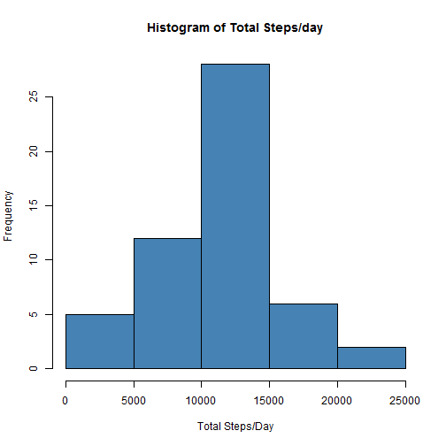
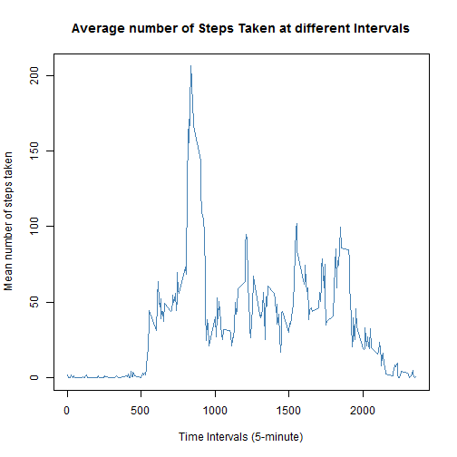
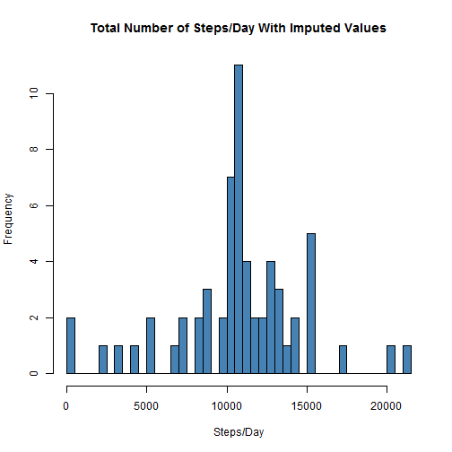
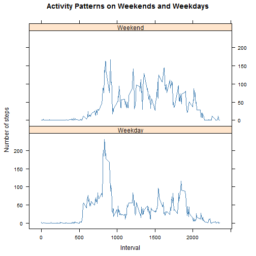

# Reproducible Research: Peer Assessment 1
Author: Akhil Kumar Ramasagaram.

## Loading and preprocessing the data

* Load the data.

```r
activity <- read.csv("activity.csv")
summary(activity)
```

```
##      steps               date          interval   
##  Min.   :  0.0   2012-10-01:  288   Min.   :   0  
##  1st Qu.:  0.0   2012-10-02:  288   1st Qu.: 589  
##  Median :  0.0   2012-10-03:  288   Median :1178  
##  Mean   : 37.4   2012-10-04:  288   Mean   :1178  
##  3rd Qu.: 12.0   2012-10-05:  288   3rd Qu.:1766  
##  Max.   :806.0   2012-10-06:  288   Max.   :2355  
##  NA's   :2304    (Other)   :15840
```

* Processing/transforming the data (if necessary) into a format suitable.

```r
activity$date <- as.Date(activity$date, "%Y-%m-%d")
```


## What is mean total number of steps taken per day?
We can find mean total number of steps taken per day by using the aggregate(). Below code calculates the number of steps taken per day.

```r
totalSteps <- aggregate(steps ~ date, data = activity, sum, na.rm = TRUE)
summary(head(TotalStepsPerDay))
```

```
## Error: object 'TotalStepsPerDay' not found
```

* Making  a histogram of the total number of steps taken each day.

```r
hist(totalSteps$steps, col = "steelblue", xlab = "Total Steps/Day", ylab = "Frequency", 
    main = "Histogram of Total Steps/day")
```

 

The __MEAN__ total number of steps taken per day is 1.0766 &times; 10<sup>4</sup>.
The __MEDIAN__ total number of steps taken per day is 10765.

## What is the average daily activity pattern?
* Making a time series plot of type = "l"  of the 5-minute interval (x-axis) and the average number of steps taken, averaged across all days (y-axis)

```r
meanSteps <- aggregate(steps ~ interval, data = activity, mean, na.rm = TRUE)
plot(steps ~ interval, data = meanSteps, type = "l", xlab = "Time Intervals (5-minute)", 
    ylab = "Mean number of steps taken", main = "Average number of Steps Taken at different Intervals", 
    col = "steelblue")
```

 

* Which 5-minute interval, on average across all the days in the dataset, contains the maximum number of steps?
The 835 interval contains the maximum number of steps on average across all the days in the data set


## Imputing missing values

* Calculate and report the total number of missing values in the dataset (i.e. the total number of rows with NAs)

```r
sum(is.na(activity$steps))
```

```
## [1] 2304
```

* Devise a strategy for filling in all of the missing values in the dataset.
I choose to impute the missing values in the Steps variable by replacing NA's with the mean.
We have to create a vector of steps variable where NA's will be replaced by new imputed values.

```r
imp_steps <- numeric()
for (i in 1:nrow(activity)) {
    X <- activity[i, ]
    if (is.na(X$steps)) {
        steps <- subset(meanSteps, interval == X$interval)$steps
    } else {
        steps <- X$steps
    }
    imp_steps <- c(imp_steps, steps)
}
```

* Create a new dataset that is equal to the original dataset but with the missing data filled in.

```r
activity_imputed <- activity
activity_imputed$steps <- imp_steps
```

* Make a histogram of the total number of steps taken each day and Calculate and report the mean and median total number of steps taken per day.

```r
imp_steps_per_day <- aggregate(steps ~ date, data = activity_imputed, sum)
hist(imp_steps_per_day$steps, breaks = nrow(imp_steps_per_day), main = "Total Number of Steps/Day With Imputed Values", 
    xlab = "Steps/Day", col = "steelblue")
```

 


## Are there differences in activity patterns between weekdays and weekends?
* Create a new factor variable in the dataset with two levels - "weekday" and "weekend" indicating whether a given date is a weekday or weekend day.

```r
Day <- weekdays(activity_imputed$date)
activity_imputed$day_type <- ifelse(Day == "Saturday" | Day == "Sunday", "Weekend", 
    "Weekday")
```


* Make a panel plot containing a time series plot (i.e. type = "l") of the 5-minute interval (x-axis) and the average number of steps taken, averaged across all weekday days or weekend days (y-axis). The plot should look something like the following, which was creating using simulated data:


```r
meanSteps.imputed <- aggregate(activity_imputed$steps, by = list(activity_imputed$interval, 
    activity_imputed$day_type), mean)
names(meanSteps.imputed) <- c("interval", "day_type", "steps")
library(lattice)
```

```
## Warning: package 'lattice' was built under R version 3.0.3
```

```r
xyplot(steps ~ interval | day_type, meanSteps.imputed, type = "l", layout = c(1, 
    2), xlab = "Interval", ylab = "Number of steps", main = "Activity Patterns on Weekends and Weekdays", 
    col = "steelblue")
```

 


